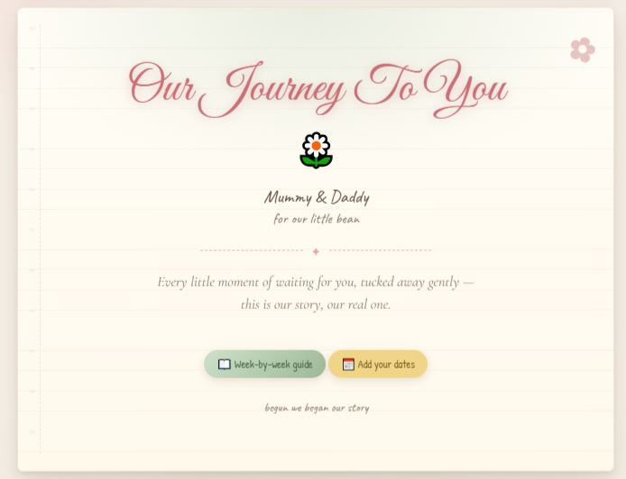
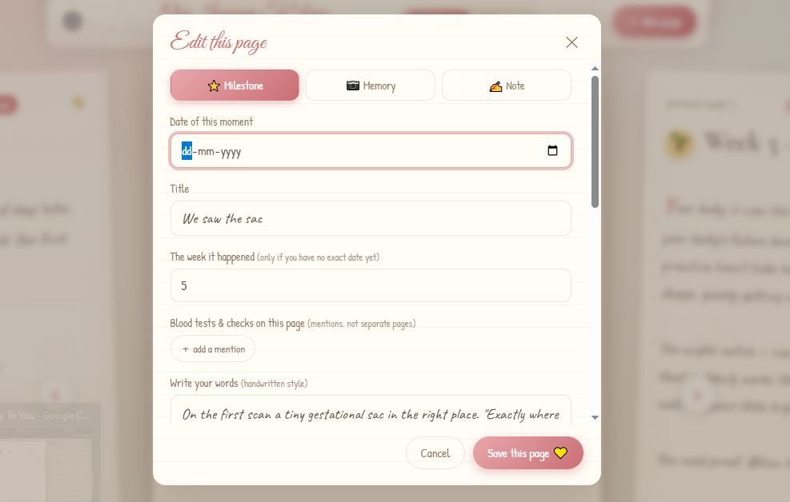
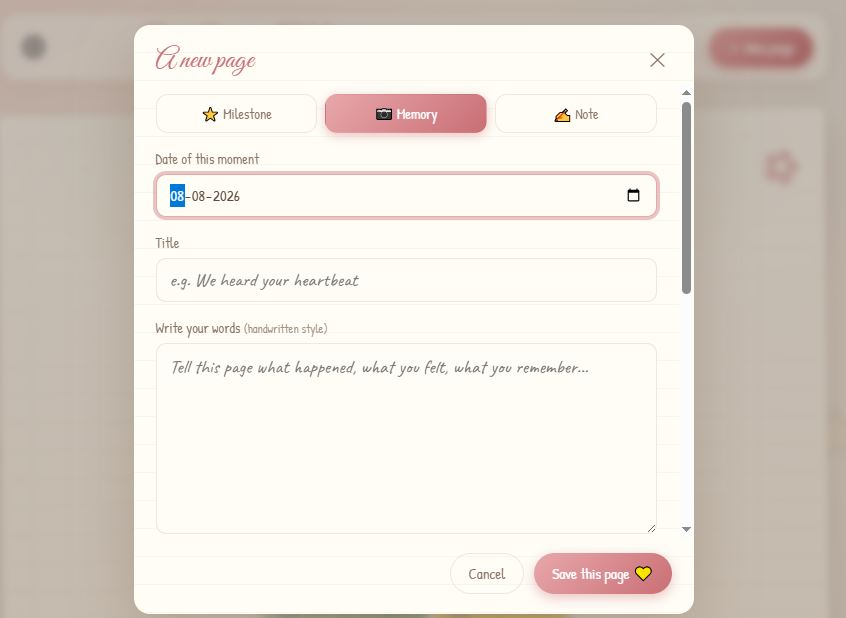
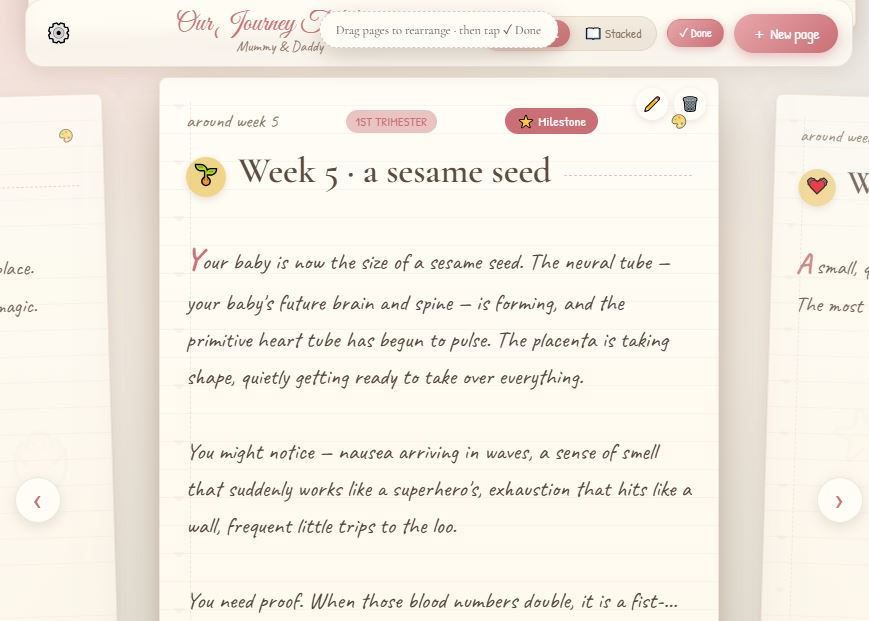
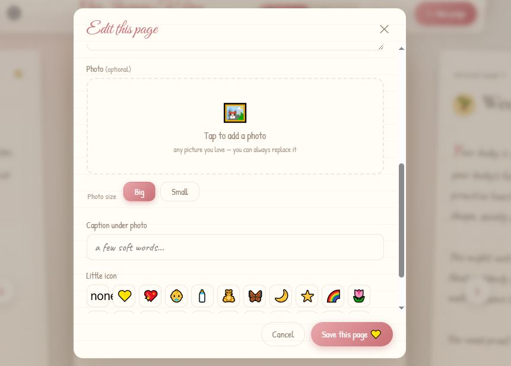
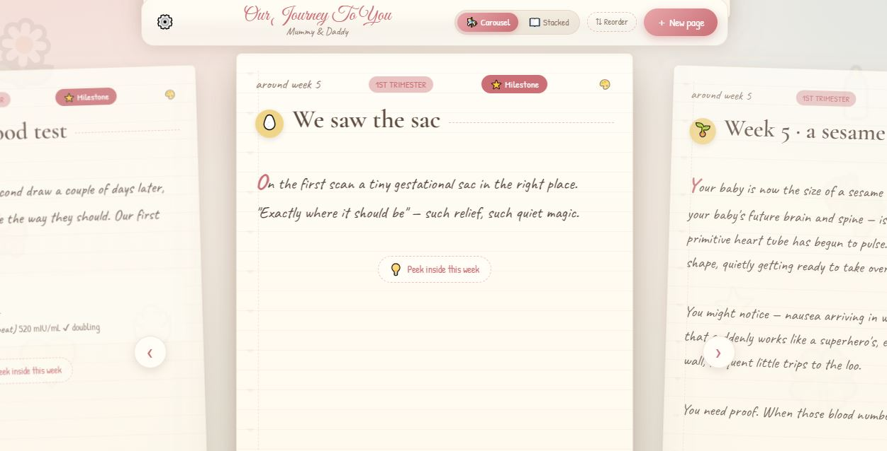
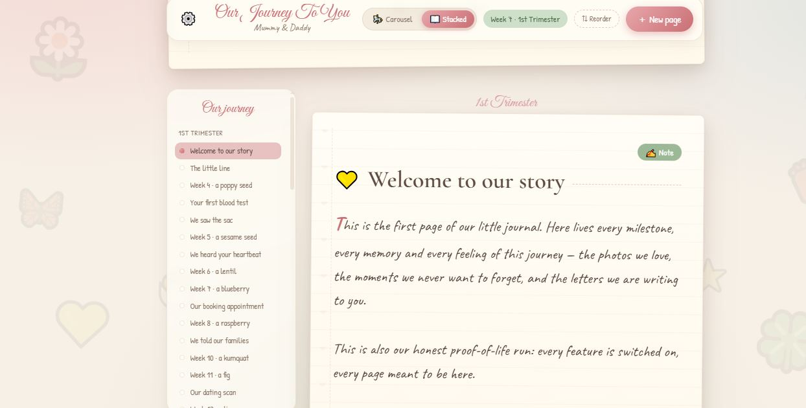
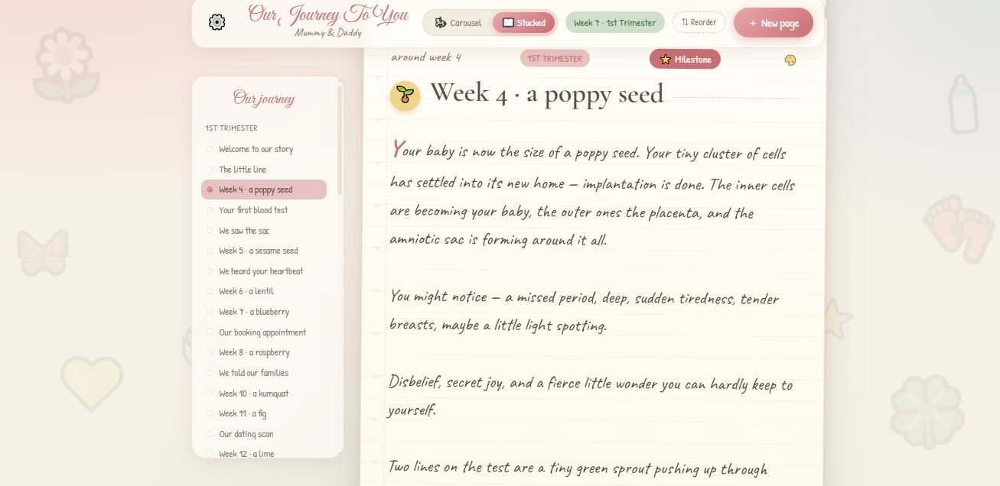
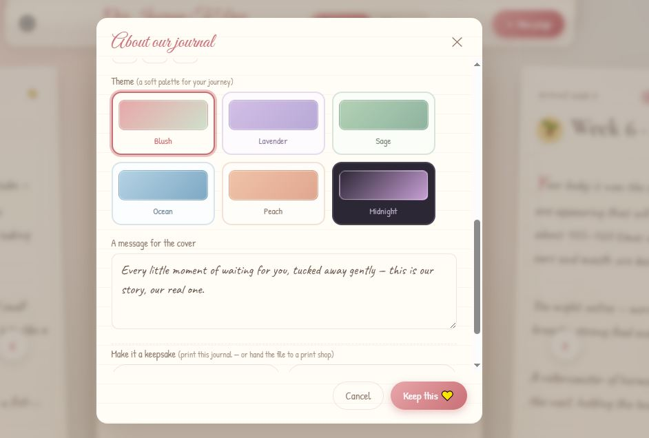
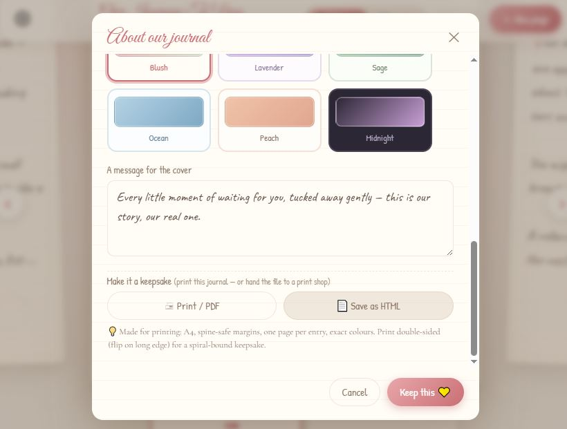

# 🌼 pregnancy-blossom-journal

[](LICENSE)
[](https://pregnancy-blossom-journal.netlify.app/)

> A soft, personal digital journal for your pregnancy journey — milestones,
> photos and memories, gently captured week by week as your little one blossoms.

Turn 40-ish weeks of quiet waiting into a keepsake you'll treasure forever.
No timers, no clinical charts — just a warm, handcrafted place to hold every
first kick, every scan, every "hurry up, little one" and all the love in between.

## ♡ Built with heart

This isn't a routine project churned out to hit a feature list — it's something
I built **passionately**, page by page, with **empathy** for every person who
will hold it. I thought hard about how a real human would *feel* while using it:
the gentle rhythm of the words, the warm palettes, the way it celebrates the
small quiet moments rather than measuring them. This is software designed
around a person's taste and feelings — not a screen's checklist.

I believe **online life should feel personal and private**. So privacy is the
foundation here, not an afterthought: your journal, your photos, your words —
never mined, never sold, never broadcast. It's a safe, quiet space that belongs
to you.

And it meets you on **your favourite device**. Install it as a **PWA** and the
whole journal lives on your phone — instantly reachable, fully offline, no
cloud, no account. One tap, and it's there whenever you need to breathe out.

I'm proud of the craft behind that. And because I know the joy of giving, this
project is **open-source** — freely available under the **Apache 2.0** license,
so other makers can build their own beautiful, private journeys — and so the
care that went into this one can reach the many, not the few.

> **✨ See it live:** try it at <https://pregnancy-blossom-journal.netlify.app/>
> — install it as an app on your phone, and it runs fully offline.

## 📖 Why I made this

I searched. A lot. Up and down, across dozens of apps and journal platforms —
and I kept coming up empty. So much of what's out there for this season of life
is cold and clinical: charts, timers, "tracker" language, a nagging sense that
*you* are the one being measured. I never found a journal that was genuinely
**lovely** — warm in the way a hand-written letter is — that actually
**blossoms** as the little one does, and that feels truly **close to a mother's
heart**.

So instead of settling, I made it. Every detail of this journal exists because
I wished something better existed — and decided someone had to be the first to
show that it could.

---

> *If this resonates, share it with someone who's on this journey. The best
> thing it can do is arrive when a heart needs it.*

---

## 👀 First look

A gentle cover that's all yours — and a journey that unfolds week by week.

<p align="center">
  
</p>

---

## 💝 Features that feel like a hug

Everything is made to be **completely customisable** — your names, your little
one's nickname, the due date, even the words on the cover. It's *your* story,
told your way.

<p align="center">
  
</p>

**Add anything, any time.** A page, a memory, a milestone — whenever the mood
strikes, capture it the moment you love it.

<p align="center">
  
</p>

**Drag, drop, rearrange.** Put the pages in exactly the order your heart wants
them — it's your journal to shape.

<p align="center">
  
</p>

### Amazing options, everywhere you look

The little things make it special — so we packed in a full set of thoughtful
options that appear exactly when you want them.

<p align="center">
  
</p>

### Flip through it two beautiful ways

**Carousel view** — swipe through your journey page by page, like turning the
leaves of a scrapbook.

<p align="center">
  
</p>

**Stacked experience** — see all your pages in one calm, flowing scroll.

<p align="center">
  
</p>

Always **easy to navigate**, however deep into your story you are.

<p align="center">
  
</p>

### Your colour, everywhere

Six themes, applied **globally** — pick the mood that matches your journey and
the whole journal falls in love with it.

<p align="center">
  
</p>

### Save it, print it, keep it forever

Capture every word and picture, then **save or print** it into a real,
spiral-bound keepsake book you'll hand your little one one day.

<p align="center">
  
</p>

---

## ✨ Features at a glance

- **Milestone pages** — the classic moments of pregnancy, ready to fill in
- **Week-by-week guidance** — heartfelt notes for every week (weeks 4–40)
- **Photo memories** — attach a photo to each page
- **Six global themes** — make it feel like yours
- **Carousel + stacked views** — browse however you like
- **Drag & drop reordering** — shape your story
- **Backup & restore** — one JSON export, import anywhere
- **Save & print** — a printed keepsake you can hold
- **Installable PWA** — works fully offline on your phone

---

## 🗺 Roadmap

> 📄 **Full product vision, architecture and decisions live in [`PRD.md`](PRD.md).**
> The short version below is the spark; the PRD is the blueprint.

This is a beginning, not the end. Here's where this little journal is headed:

- **A real, full-fledged app** — on the **App Store and Google Play**, not just
  a web page. And true to its soul, it stays **fully local & private**: no
  servers to watch you, **no keys**, **no pricing**. Yours, forever.
- **A baby bot that nudges you.** Imagine a voice that reaches out *as your
  little one* — cheering on the progress you're making, gently present between
  entries. Not another self-interested LLM: an **empathetic layer** designed to
  *elevate* the experience, to make the journey feel held and seen.
  - *How it powers itself:* it needs an LLM provider key under the hood. I'm
    exploring **sign-in with Google** so your *own* key can do the talking
    (password-free, private), or sharing a key I provision myself. *(t.b.d.)*
  - You'll always stay in control — the empathetic layer is an option, never a
    requirement, and never a data grab.

---

## 🤝 Make it even more beautiful

This journal is meant to be grown, like the journey it holds. If you feel the
care, you can help it blossom further:

- **Tidy a detail, polish a palette, or refine a word** — the small things move
  the needle on how it *feels*.
- **Share your thoughts with human empathy** — design that considers someone's
  feelings is better with many hearts behind it.
- **Spread the word** — the loveliest thing you can contribute is letting a
  mother-to-be know this exists.

Every contribution — code or kindness — makes it gentler. The project aims to
be **open-source**, so this can grow beyond one person's care.

---

## 🗂 Two ways to run

### 1. Web app (server-backed)

Node + Express with an HTTP API and photo uploads.

```bash
npm install
npm start
# → http://localhost:4173
```

| Method | Endpoint | Purpose |
| ------ | -------- | ------- |
| GET | `/api/settings` | Read journal settings |
| PUT | `/api/settings` | Update journal settings |
| GET | `/api/entries` | List all pages |
| POST | `/api/entries` | Create a page (photo upload) |
| PUT | `/api/entries/:id` | Update a page (photo upload) |
| DELETE | `/api/entries/:id` | Delete a page |
| POST | `/api/reorder` | Reorder pages |
| POST | `/api/restore-milestones` | Restore the default milestone skeleton |

### 3. Native app (Flutter — iOS + Android)

The roadmap's Phase 5 lives in [`app/`](app/README.md) — a Flutter codebase
sharing the six themes and the week-by-week guidance (via
`tools/sync_guide.mjs`, the single source of truth). Work in progress.

```bash
cd app
flutter run
```

---

### 2. PWA (serverless, fully offline)

Everything lives on the phone itself (IndexedDB) — no server, no cloud.

```bash
cd pwa
node serve.js
# → http://localhost:4174
```

Serve it over `localhost` (or any HTTPS host), **Add to Home Screen**, and it
runs full-screen, offline, forever. See [`pwa/README.md`](pwa/README.md) for
installation and data-migration details.

---

## 🧰 Helper scripts

- `seed-demo.js` — seed demo pages for testing
- `make-sample.js` — generate sample content
- `placeholder.js` — placeholder helpers
- `test-api.js` — smoke-test the API

## 🤖 Blossom Baby (the AI companion)

A hyper-cute, week-grounded chatbot that speaks **as your little one** —
"medical empathy, never medical advice". Floating chat bubble (all screens), a
cover hook, and an "Ask about this week" button in the week guide. Grounded in
the current week from `guide-data.js` + LMP/due date; a red-line lexicon
(bleeding, severe pain, loss of movement…) is checked **before any model call**
and always answers with a caring "contact your doctor / emergency services".

**Privacy-first by design:**
- No chat content is ever stored server-side — only anonymous daily counters.
- Consent-first: nothing is sent until mama taps "Sounds good".
- **BYOK** (advanced): her own Gemini key → messages go straight to Google,
  never through the server.
- One-time disclaimer: "a cheerleader, not a doctor".

**Setup (optional — mock mode works without it):**
```bash
# server-side Gemini key (never shipped to the client)
export GEMINI_API_KEY=AIza…            # or put it in data/.env.local (gitignored)
export CHAT_ADMIN_TOKEN=choose-one     # for the dashboard
node server.js                         # then open /admin with that token
```
Tunable caps: `CHAT_DAILY_DEVICE` (20), `CHAT_DAILY_IP` (30), `CHAT_DAILY_GLOBAL` (1000).
The PWA talks to the journal server's `/api/chat` — set `apiBase` in `pwa/app.js`
to your deployed URL when you ship it.

## 🔒 Privacy

Your journal is yours. The server's real entries and photos live in `data/`
(entries.json, settings.json, photos/), which is git-ignored — **never
published**. The PWA keeps everything local on the device. Back up regularly
from **Settings → ⬇ Export backup**.

## 📄 License

Licensed under the **Apache License 2.0** — free to use, modify, and even
commercialize, with attribution. See [LICENSE](LICENSE) for the full terms.
